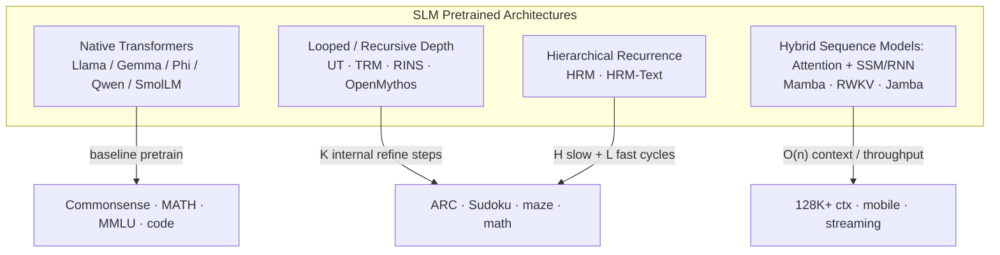

# Deep Survey: Pretrained Architectures for Small Language Models (SLM)

> **Scope:** Decoder-only and reasoning-oriented foundation architectures in the **100M–5B** parameter range, organized by the taxonomy in this repository.  
> **Last updated:** May 2026  
> **Method:** Literature review (arXiv/NeurIPS/ICLR 2024–2026), benchmark surveys, and inspection of cloned reference implementations.

---

## 1. Executive Summary

The SLM landscape in 2025–2026 splits into four architectural families:

| Family | Core idea | Best when… | Representative repos (cloned here) |
|--------|-----------|------------|-------------------------------------|
| **Native Transformers** | Standard depth-wise stacked decoder blocks (GQA, RoPE, SwiGLU) | You need proven pretraining recipes, HF/vLLM ecosystem, broad benchmarks | `native_transformers/smollm` |
| **Looped / Recursive** | Reuse the same block(s) for *K* internal steps → more effective depth, fewer unique params | Reasoning, algorithmic tasks, test-time compute scaling | `looped_arc/TinyRecursiveModels`, `nano-trm`, `utm-jax`, `OpenMythos` |
| **Hierarchical** | Two (or more) modules at different timescales: slow planner + fast worker | Structured reasoning without explicit CoT; sample-efficient training | `hierachical_arc/HRM`, `hybrid_arc/HRM-Text` |
| **Hybrid (non-pure-attention)** | Mix Transformer attention with SSM/RNN layers for linear-time context | Long context, edge deployment, throughput-sensitive inference | `hybrid_arc/mamba`, `RWKV-LM`, `HRM-Text` (PrefixLM + recurrent) |

**Key trend:** Pure scaling of transformer width/depth is no longer the only path. **Recurrence in depth** (HRM, TRM, Universal Transformer, RINS, looped transformers) and **hybrid sequence mixers** (Jamba, Mamba, RWKV) are competitive especially for reasoning and long-context SLMs.

**Data-quality insight** (from ACL 2025 edge-deployment study): SmolLM, DCLM-1B, and Phi-3 families punch above their weight largely due to **curated pretraining mixtures**, not architecture alone.

---

## 2. Taxonomy & Architecture Map



---

## 3. Native Transformers (`native_transformers/`)

The **default SLM backbone**: decoder-only Transformer with modern efficiency tricks. Most production SLMs (1–5B) still use this stack.

### 3.1 Canonical building blocks

| Component | Typical choice in SLMs | Why |
|-----------|------------------------|-----|
| Attention | **GQA** (Grouped Query Attention) | Cuts KV-cache size vs MHA; used in Llama 3, Gemma 2/3, Qwen2.5 |
| Positional | **RoPE** (+ YaRN / LongRoPE for extension) | Gemma 3: local layers @ 10k freq, global @ 1M for 128K context |
| FFN | **SwiGLU** or GELU variants | SwiGLU in Llama/Qwen/SmolLM; Gemma uses GELU-tanh |
| Norm | **RMSNorm** (pre-norm) | Stable training at small scale |
| Init / scaling | **muP**, depth-scaled init | Phi-3-small uses muP for hyperparameter transfer |

### 3.2 Major pretrained SLM families (2024–2026)

| Model | Params (SLM range) | Notable architecture | Pretrain scale | Open weights |
|-------|-------------------|----------------------|----------------|--------------|
| **SmolLM3** | 3B | Standard decoder + NoPE + YaRN 128K | 11T tokens, fully documented mixture | ✅ HF |
| **Phi-3 / 3.5** | 3.8B–14B (mini in SLM band) | GQA; phi-3-small: block-sparse attention | High-quality synthetic + filtered web | ✅ |
| **Gemma 2 / 3** | 1B–4B | GQA, QK-norm, alternating local/global attn (Gemma 3) | Google curated | ✅ |
| **Qwen2.5** | 0.5B–3B | GQA, strong multilingual | Large multilingual corpus | ✅ |
| **Llama 3.2** | 1B–3B | Standard Llama 3 stack | Meta scale | ✅ |
| **MobileLLM** | sub-1B | **Depth repetition (RAO)** — precursor to RINS | On-device focus | Partial |

### 3.3 Cloned reference: `native_transformers/smollm`

- **Why clone:** Fully open **pretraining recipe** (data mixture, configs, eval) — rare among SLMs.
- **Highlights:** SmolLM3-3B competitive with 4B models; dual-mode reasoning (think / no-think); 128K via NoPE+YaRN.
- **Weights:** `HuggingFaceTB/SmolLM3-3B`, `SmolLM3-3B-Base`
- **Use for:** Reproducible baseline pretraining pipeline, data ablations, instruction tuning.

### 3.4 When to choose native transformers

- Broad general-purpose chat / RAG / tool use
- Need mature tooling (Transformers, vLLM, GGUF, ONNX)
- Team lacks bandwidth to debug novel recurrence training

---

## 4. Looped & Recursive Architectures (`looped_arc/`)

**Definition:** The model applies the **same parameters** multiple times per forward pass, increasing *effective depth* without linear parameter growth. Reasoning happens in **latent space**, not via generated CoT tokens.

### 4.1 Lineage

```
Universal Transformer (2018)     — depth recurrence + ACT
        ↓
MobileLLM RAO / RINS (2024–25)   — repeat blocks for mobile SLMs
        ↓
HRM (2025)                       — hierarchical H/L recurrence
        ↓
TRM (2025)                       — simplified single-stack recursion
        ↓
HRM-Text (2026)                  — scale HRM to 1B LM pretraining
        ↓
OpenMythos / RDT (2025–26)       — Prelude → looped block × T → Coda
```

### 4.2 Key methods compared

| Method | Recurrence pattern | Params (typical) | Pretrain? | Standout result |
|--------|-------------------|------------------|-----------|-----------------|
| **Universal Transformer** | Same layer block × T steps; optional ACT halting | Any | Yes (T2T) | Turing-complete depth; strong on algorithmic tasks |
| **RINS** (NeurIPS 2025) | Specific depth-sharing recipe; stochastic skip at inference | Plug-in to existing LM | Yes | Beats 55+ recursive variants compute-matched |
| **TRM** | Update latent **z** then answer **y** for K steps | **7M** | Task-specific | 45% ARC-AGI-1, 8% ARC-AGI-2 |
| **UTM-Jax** | UT + **memory tokens** + bounded ACT | Small | Sudoku-Extreme | Memory tokens required for hard reasoning |
| **OpenMythos (RDT)** | Prelude → 1 block × T with input injection → Coda |  ( .17M–100M+ | Experimental | Inference loops = more "thinking time" |

### 4.3 Cloned references

#### `looped_arc/TinyRecursiveModels` ⭐ (official TRM)
- **Paper:** [Less is More: Recursive Reasoning with Tiny Networks](https://arxiv.org/abs/2510.04871) (arXiv:2510.04871)
- **Stars:** ~6.5k | **License:** MIT | **Status:** Archived (read-only) but canonical
- **Architecture:** Single tiny network; recursively refines `(x, y, z)` — question embedding, current answer, latent state
- **Training:** ~1000 ARC examples, no LLM pretrain; Adam-atan2; EMA
- **Checkpoints:** HF `seconds-0/trm-arc2-8gpu` and others

#### `looped_arc/nano-trm`
- **Purpose:** Clean, fast TRM reimplementation (Hydra + Lightning + uv)
- **Use for:** Minutes-scale experiments on Sudoku 4×4/6×6; easier than full TRM repo

#### `looped_arc/utm-jax`
- **Paper:** *Universal Transformers Need Memory* (JAX/TPU)
- **Key finding:** Memory tokens in the recurrent loop are **necessary** for Sudoku-Extreme at this config
- **Use for:** Studying ACT, depth–state tradeoffs, TPU training

#### `looped_arc/OpenMythos`
- **Purpose:** Recurrent-Depth Transformer (RDT) hypothesis implementation
- **Structure:** `h_{t+1} = A·h_t + B·e + Transformer(h_t, e)` with MoE FFN, GQA/MLA
- **Use for:** Looped SLM prototyping, inference-time loop scaling experiments

### 4.4 When to choose looped/recursive

- Reasoning / puzzle / program-synthesis benchmarks (ARC, Sudoku, mazes)
- Fixed compute budget but need **adaptive test-time depth**
- Research on latent reasoning without CoT supervision

---

## 5. Hierarchical Architectures (`hierachical_arc/` + HRM-Text)

**Definition:** Two (or more) coupled recurrent modules operating at **different abstraction levels and timescales**, inspired by cortical hierarchy.

### 5.1 HRM — Hierarchical Reasoning Model

| Property | Value |
|----------|-------|
| **Paper** | [Hierarchical Reasoning Model](https://arxiv.org/abs/2506.21734) (arXiv:2506.21734) |
| **Params** | 27M |
| **Modules** | **H-level** (slow, abstract) + **L-level** (fast, detailed) |
| **Training data** | ~1000 task examples (ARC, Sudoku, Maze) — **no LM pretrain** |
| **ARC-AGI-1** | ~40.3% (beats many CoT LLMs at much larger scale) |

**Mechanism:** Nested cycles — L-module runs `L_cycles` per H-cycle; H-module runs `H_cycles`. Hidden states `(z_H, z_L)` co-evolve; input injected via additive fusion into transformer blocks.

### 5.2 HRM-Text — scaling hierarchy to language pretraining

| Property | Value |
|----------|-------|
| **Paper** | [HRM-Text: Efficient Pretraining Beyond Scaling](https://arxiv.org/abs/2605.20613) |
| **Params** | 0.6B (L) / 1B (XL) |
| **Claim** | 130–600× less compute, 150–900× less data vs standard LM pretrain |
| **Cost** | ~$800–$1500 on H100s for reference runs |
| **Benchmarks (XL 1B)** | GSM8k 84.7%, MATH 56.5%, MMLU 60.7% |

**Training stack (unique to HRM-Text):**
- PrefixLM sequence packing + FlashAttention 3 two-pass attention
- FSDP2 distributed pretraining
- Baselines in same codebase: vanilla Transformer, TRM, RINS, Universal Transformer

**Config snapshot** (`hybrid_arc/HRM-Text/config/arch/net/hrm.yaml`):
- `H_cycles: 2`, `L_cycles: 3`, `half_layers: true` (split layers between H and L)
- `bp_warmup_ratio: 0.2` for backprop-through-time stability

### 5.3 Cloned references

| Path | Description |
|------|-------------|
| `hierachical_arc/HRM` | Original 27M reasoning model + ARC/Sudoku/Maze training |
| `hybrid_arc/HRM-Text` | Full 1B LM pretraining framework (already present) |

### 5.4 When to choose hierarchical

- Sample-efficient reasoning from scratch
- You want **brain-inspired multi-timescale** computation without explicit CoT
- Exploring whether hierarchy beats flat recurrence at 1B+ LM scale (HRM-Text thesis)

---

## 6. Hybrid Architectures (`hybrid_arc/`)

**Definition:** Combine **Transformer self-attention** with **sub-quadratic sequence mixers** (SSM, linear attention, RNN) in one decoder stack.

### 6.1 Major hybrid families

| Architecture | Mixer types | MoE? | Context | SLM-relevant notes |
|--------------|-------------|------|---------|-------------------|
| **Mamba / Mamba-2 / Mamba-3** | Pure selective SSM | No (in base) | Linear time | Pretrained 130M–2.8B on Pile/SlimPajama |
| **RWKV-7** | Linear attention + RNN state | No | Infinite (theoretical) | 100% attention-free; parallelizable training |
| **Jamba / Jamba-1.5** | Interleaved Transformer + Mamba | Yes | 256K | Mini: 12B active / 52B total — borderline SLM at edge |
| **HRM-Text** | Transformer blocks + hierarchical recurrence | No | PrefixLM packed | Hybrid of attention + latent recurrence |

### 6.2 Mamba (cloned: `hybrid_arc/mamba`)

- **Paper:** Mamba (2312.00752), Mamba-2 SSD (2405.21060), Mamba-3 (2603.15569)
- **Core:** Selective state-space layer — input-dependent Δ, B, C → hardware-efficient parallel scan
- **Pretrained checkpoints:** `mamba-130m` … `mamba2-2.7b` on HuggingFace
- **SLM angle:** Sub-3B Mamba-2 models approach Transformer perplexity with **O(n)** memory

### 6.3 RWKV (cloned: `hybrid_arc/RWKV-LM`)

- **Paper series:** RWKV-1 through **RWKV-7 "Goose"**
- **Core:** WKV operator = linear-time "attention" with fixed hidden state; no KV cache growth
- **SLM angle:** Strong for **on-device streaming** and constant memory at decode
- **Tradeoff:** Long-range dependency capture differs from full attention; ecosystem smaller than Llama

### 6.4 Jamba (reference only — weights on HF, no training repo cloned)

- **Paper:** Jamba (ICLR 2025), Jamba-1.5 (2408.12570)
- **Pattern:** Jamba block = Mamba layer + Attention layer + MoE FFN
- **Why mention:** Defines the **production hybrid template** AI21 uses at scale
- **Weights:** `ai21labs/Jamba-1.5-Mini`, `Jamba-1.5-Large`

### 6.5 When to choose hybrid

- Context length >> model size constraints (128K+ on one GPU)
- Throughput / memory at decode time matters (mobile, streaming)
- Willing to adopt less mature tooling than pure Transformers

---

## 7. Cross-Cutting: RINS & MobileLLM depth sharing

**RINS** ([Recursive Inference Scaling](https://arxiv.org/html/2502.07503), NeurIPS 2025) is implemented as a baseline inside HRM-Text (`config/arch/net/rins.yaml`).

| Aspect | Detail |
|--------|--------|
| Idea | Specific parameter-sharing recursion beats 55+ alternatives (incl. MobileLLM RAO, Huginn latent thinking) |
| Training | Compute-matched vs flat transformer |
| Inference | Optional — stochastic adapters allow **no-regret** pretrain even if recursion skipped at inference |
| Multimodal | +2% ImageNet zero-shot on SigLIP-B/16 |

Relevant for SLM teams that want **depth without width** under fixed FLOPs.

---

## 8. Benchmark & Survey References

| Survey / study | Focus | Link |
|----------------|-------|------|
| SLMs Can Still Pack a Punch (2025) | Task-agnostic vs task-specific SLMs, Llama/Phi/Gemma landscape | [arXiv:2501.05465](https://arxiv.org/html/2501.05465v1) |
| SLM Architectures survey (2024) | Compression, pruning, quantization taxonomy | [arXiv:2410.20011](https://arxiv.org/pdf/2410.20011) |
| SLM Architectures, Techniques (2025) | Encoder/decoder, RWKV, long-context hybrids | [arXiv:2505.19529](https://arxiv.org/pdf/2505.19529) |
| Survey, Measurements & Insights (2024) | 57 SLMs, 100M–5B, on-device latency + accuracy | [arXiv:2409.15790](https://arxiv.org/pdf/2409.15790) |
| Demystifying SLMs for Edge (ACL 2025) | 32 open SLMs — accuracy vs latency(uint8) vs latency | [ACL 2025](https://aclanthology.org/2025.acl-long.718.pdf) |

**ACL 2025 edge study takeaway:** Qwen2-1.5B often beats 3B models; SmolLM-1.7B and DCLM-1B lead commonsense at ~1B; **data quality > raw parameter count** for SLMs.

---

## 9. Decision Matrix: Which architecture for your SLM?

| Goal | Recommended starting point | Repo in this workspace |
|------|---------------------------|------------------------|
| General 1–3B chat model, fully open recipe | SmolLM3 pipeline | `native_transformers/smollm` |
| Math/reasoning with <$2k pretrain budget | HRM-Text XL 1B | `hybrid_arc/HRM-Text` |
| ARC / algorithmic reasoning from scratch | TRM or HRM | `looped_arc/TinyRecursiveModels`, `hierachical_arc/HRM` |
| Long context on single GPU | Mamba-2 1.3B or Gemma 3 1B | `hybrid_arc/mamba` |
| Edge streaming, no KV cache | RWKV-7 | `hybrid_arc/RWKV-LM` |
| Research: loop depth vs compute | OpenMythos or UTM-Jax | `looped_arc/OpenMythos`, `utm-jax` |
| Plug-in depth sharing under fixed FLOPs | RINS baseline in HRM-Text | `hybrid_arc/HRM-Text` configs |

---

## 10. Cloned Repository Index

```
foundation_model/
├── SURVEY.md                          ← this document
├── native_transformers/
│   └── smollm/                        ← HuggingFace SmolLM family (training docs + tools)
├── looped_arc/
│   ├── TinyRecursiveModels/           ← Official TRM (Samsung SAIL)
│   ├── nano-trm/                      ← Lightweight TRM for fast experiments
│   ├── utm-jax/                       ← Universal Transformer + memory tokens (JAX)
│   └── OpenMythos/                    ← Recurrent-Depth Transformer (looped block)
├── hierachical_arc/
│   └── HRM/                           ← Original 27M hierarchical reasoning model
└── hybrid_arc/
    ├── HRM-Text/                      ← 1B hierarchical LM pretraining (existing)
    ├── mamba/                         ← Mamba SSM official implementation
    └── RWKV-LM/                       ← RWKV linear-time LM
```

### Quick start commands

```bash
# SmolLM3 inference
pip install transformers accelerate
python -c "from transformers import AutoModelForCausalLM, AutoTokenizer; \
  m=AutoModelForCausalLM.from_pretrained('HuggingFaceTB/SmolLM3-3B'); \
  t=AutoTokenizer.from_pretrained('HuggingFaceTB/SmolLM3-3B'); \
  print(t.decode(m.generate(**t('Hello', return_tensors='pt'), max_new_tokens=20)[0]))"

# HRM-Text pretrain (see README for data_io + Docker)
cd hybrid_arc/HRM-Text
docker run --gpus all --ipc=host -v "$PWD":/workspace sapientai/hrm-text:latest

# TRM ARC training
cd looped_arc/TinyRecursiveModels
pip install -r requirements.txt
python -m dataset.build_arc_dataset --subsets training evaluation concept

# HRM reasoning (27M)
cd hierachical_arc/HRM
pip install -r requirements.txt
# See README for Sudoku / ARC / Maze configs
```

---

## 11. Open Research Questions (2026)

1. **Does hierarchical recurrence (HRM) generalize beyond 1B** as well as flat transformers at 7B+?
2. **TRM vs HRM:** Is hierarchy necessary, or is TRM's simplicity sufficient at scale?
3. **Hybrid at SLM scale:** Do Jamba-style interleaves beat pure Mamba/RWKV below 3B params?
4. **Looped inference scaling:** Can loop count at inference time replace CoT token generation reliably for math?
5. **Unified pretrain:** Can RINS-style depth sharing become default in MobileLLM-class edge models?

---

## 12. Citations (selected)

```bibtex
@misc{wang2025hierarchicalreasoningmodel,
  title={Hierarchical Reasoning Model},
  author={Guan Wang and others},
  year={2025}, eprint={2506.21734}, archivePrefix={arXiv}
}

@misc{wang2026hrmtext,
  title={HRM-Text: Efficient Pretraining Beyond Scaling},
  author={Guan Wang and others},
  year={2026}, eprint={2605.20613}, archivePrefix={arXiv}
}

@misc{jolicoeurmartineau2025trm,
  title={Less is More: Recursive Reasoning with Tiny Networks},
  author={Alexia Jolicoeur-Martineau},
  year={2025}, eprint={2510.04871}, archivePrefix={arXiv}
}

@misc{gu2023mamba,
  title={Mamba: Linear-Time Sequence Modeling with Selective State Spaces},
  author={Albert Gu and Tri Dao},
  year={2023}, eprint={2312.00752}, archivePrefix={arXiv}
}

@inproceedings{alabdulmohsin2025rins,
  title={Recursive Inference Scaling},
  author={Ibrahim Alabdulmohsin and Xiaohua Zhai},
  booktitle={NeurIPS}, year={2025}
}

@misc{dehghani2018ut,
  title={Universal Transformers},
  author={Mostafa Dehghani and others},
  year={2018}, eprint={1807.03819}, archivePrefix={arXiv}
}
```

---

*Generated as part of the foundation_model SLM architecture survey. For questions or to extend with additional repos (e.g., Qwen, Gemma training forks, Jamba fine-tunes), add under the matching category folder and update this index.*
